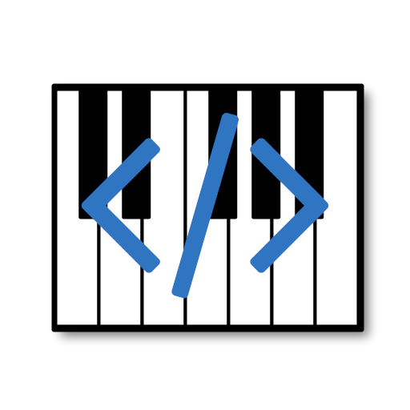

# mpp-server-dev2

Multiplayer Piano server for [MPP.dev](https://www.multiplayerpiano.dev)

## Quick Start

This section will only describe a minimal configuration for running the server.

0. Install Bun

See [Bun's website](https://bun.sh/) for specific instructions for your operating system. As a quick note, the server is developed and hosted on Linux, so I recommend Windows users to use WSL if you encounter bugs running natively.

1. Setup the repository

Quick note: This repository utilizes multiple Git submodules for the hosted frontend files.

```
$ git clone --recursive https://github.com/Hri7566/mpp-server-dev2
```

Once you have the repository downloaded, copy `.env.template` to `.env` and edit the parameters to match your environment.

```
$ cp .env.template .env
```

Alternatively, you can pass the environment variables through the shell itself when running the server.

2. Create a JSON Web Token signing key

In order to use JWTs (info [here](https://jwt.io/introduction) for the unfamiliar), you must setup a signing key. This can be done easily with the OpenSSL command.

```
$ openssl genrsa -out mppkey 2048
```

The file the server looks for is called `mppkey` by default. This may be configurable in the future.

3. Create a database

This server uses Prisma ORM connected to SQLite for its database management. Here are the commands to generate a database with Prisma's CLI tool:

```
$ bunx prisma generate
$ bunx prisma db push
```

This will create a SQLite database with blank tables in `prisma/db.sqlite` (or however you setup the environment variables in step 1).

4. Run the server

The `package.json` file contains two scripts, one for production and one for development:

```
$ bun run start
$ bun run dev
```

The server's entrypoint is located at `src/start.ts`. This is because the server can also be included as a module from another script.

Hopefully, at this point, the server is running. If these instructions do not work, please submit an issue.

## Description

This is an MPP server currently in development for [MPP.dev](https://www.multiplayerpiano.dev). It is roughly feature complete, supporting many of the planned ideas already, but certain features that some users might want to use for another site are currently unimplemented, namely a more complicated scheme for the antibot system.

This server uses Bun - not just the runtime, but the internal libraries as well. This is because Bun provides easy access to uWebSockets.js, a speedy implementation of WebSockets that heavily outperforms the old `ws` module that is used so frequently in other MPP servers and MPP-related code.

I have tried to comply well with Brandon Lockaby's original MPP server so that this server stays widely accessible for any frontend implementation, including the ones used by MultiplayerPiano.net, LapisHusky's frontend, and the frontends used by nagalun's server, as well as the smnmpp and mpp.hri7566.info frontends.

Of course, most of the ones I have listed probably won't work yet because I haven't implemented a way to switch between token authentication and legacy connections yet.

Regardless, this server is meant for speed, stability, and compatability.

This server uses Prisma as an ORM for saving user data, and is currently setup to interface with SQLite. I may be switching this to PostgreSQL in the very near future, so don't get too comfortable with SQLite.

Brandon's server originally used MongoDB for storing user data, but there are too many reasons to list why it isn't fit for this project here, so I will link [this video by Theo](https://www.youtube.com/watch?v=cC6HFd1zcbo) instead.

## Naming

This server is a rewrite/reimplementation of the MPP.dev server specifically, which was called `mpp-server-dev` in its final stage of development.

The `dev` in the name is only referring to the name of the website itself, not to the fact this server is still in development.

In the future, this might just be renamed to `mpp-server` or `mpp-server-dev` again with the version `v2.0.0`, given that the original server is no longer in development.

This has always been the future intention of this project.

## List of features

-   Chat
    -   Original chat filter by chacha and Brandon Lockaby
    -   Commands for debugging or administrative purposes
-   Piano Notes
    -   Uses the same `NoteQuota` implementation from the client
-   Usernames/colors
    -   Allowing color changing can be toggled in the config, similar to MPP.com
    -   Default user parameters can be set
    -   Configurable ID and color generation methods
-   Channels
    -   Channel list
    -   Channel settings
    -   Options to keep channels forceloaded
        -   Configurable
        -   Ability to forceload at runtime
-   Rate limits
    -   Borrowed from Brandon's GitHub Gist account
-   Brandon-style admin messages
    -   Remote name changing
    -   Color changing
    -   User flag settings
        -   Ability to change the volume of users' notes (affects note velocity)
        -   Chat muting
        -   Rate limit bypasses
    -   Channel/User-targeted notifications
    -   Server-wide/channel-specific/user-specific notifications
-   New admin messages
    -   Restart message
        -   Triggers notification on every connected socket, then shuts down after 20 seconds
        -   Server must be setup as a pm2/docker/systemd process for automatic restarting
    -   Ability to change tags
        -   Similar to the MPP.net server, but uses a Brandon-style admin message
    -   Ability to rename channels
    -   Chat clearing similar to MPP.net
    -   Channel forceloading message
-   YAML configs
    -   Automatic reloading of configs during runtime via file watching
    -   Interfacing handled by JS Proxy objects
-   Templating on frontend
    -   Handles changing things on page based on config
    -   Requires the use of `mpp-frontend-dev` to function properly

## TODO

-   [x] Token generation
    -   [x] Frontend implementation
    -   [x] Token generator
    -   [ ] Test if they even work correctly
-   [x] Permission groups and permissions
    -   [x] Probable permission groups: owner, admin, mod, trialmod, default
    -   [x] Setup tags for each permission group
    -   [ ] Implement permissions into rest of server
    -   [ ] Probably already needs to be reworked, given the weird state of how tags work
-   [x] MPP.com data message
    -   Implement based on `spooky.js` given there is no official documentation
    -   This could be useful for only a few things, but still good for debugging
-   [ ] No cussing setting
    -   [ ] Decide on "lyrical notes"
-   [x] Full server-wide event bus
    -   [ ] Channel events
    -   [ ] Socket events
    -   [ ] User data events
    -   [ ] Permission-related events
-   [ ] Redo ratelimits
-   [ ] Test fishing bot
-   [ ] Remote console
-   [x] Modify frontend to use templating
    -   [x] index.html
    -   [x] Load configs on client
    -   [x] Tags
        -   [ ] Update tags live when changing from server console

## Backlog/Notes

-   Use template engine instead of raw HTML?
    -   Change frontend files at runtime?
    -   Split script.js into multiple files
    -   Implement tags as a server option, toggles code on frontend
        -   Same with color changing
-   Reload config files on save
-   Expose API?
-   Client type identification?
    -   Check for certain css?
    -   Check for different messages?
    -   Check for URL?
    -   Notifications for server-generated XSS?
    -   Somehow check for templating, maybe with the existing httpIPCache?
-   Migrate to PostgreSQL instead of SQLite
    -   Likely a low priority, we use prisma anyway, but it would be nice to have a non-blocking database
-   Implement user caching
    -   Skip redis due to the infamous licensing issues
        -   fork?
    -   Probably use a simple in-memory cache
    -   Likely store with leveldb or JSON
-   Socket events could all be handled in one emitter
    -   Maybe use one external emitter so the functions aren't copied on each conncetion
        -   Does JS/Bun use symbols for such a thing already?
